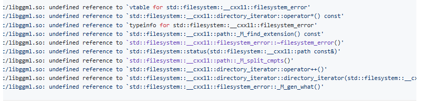

### llama.cpp
> Make sure:
> cmake version >= 3.8
> gcc version >= 14.0  follow:
https://github.com/ggerganov/llama.cpp/issues/10978
https://blog.csdn.net/weixin_43354152/article/details/129247408
> model: https://huggingface.co/hfl/llama-3-chinese-8b-instruct-v3-gguf/tree/main、https://huggingface.co/models?library=gguf&sort=trending

	
Bugs & Version limit

	
- If gcc version < 8.0: "CUDA17" error
- If gcc version < 14.0: 
- Solution: using ubuntu > 20.04

	
Steps

- Demo: *To be done...*
- Fine-tuning: https://www.llama.com/docs/how-to-guides/fine-tuning
- Quantize:https://symbl.ai/developers/blog/a-guide-to-quantization-in-llms/、https://github.com/Hoper-J/AI-Guide-and-Demos-zh_CN/blob/master/Guide/18.%20%E6%A8%A1%E5%9E%8B%E9%87%8F%E5%8C%96%E6%8A%80%E6%9C%AF%E6%A6%82%E8%BF%B0%E5%8F%8A%20GGUF%3AGGML%20%E6%96%87%E4%BB%B6%E6%A0%BC%E5%BC%8F%E8%A7%A3%E6%9E%90.md#%E7%90%86%E8%A7%A3-gguf-%E6%A8%A1%E5%9E%8B%E6%96%87%E4%BB%B6%E5%90%8D

### llama-cpp-python
> Need the same condition above, but more easy.
> Source: https://github.com/abetlen/llama-cpp-python

To run the demo, see [run.md](./run.md).

	
Steps

- LlmDemo: [llm_test.py](./llm_test.py)
- RAG1: https://medium.com/@cch.chichieh/rag%E5%AF%A6%E4%BD%9C%E6%95%99%E5%AD%B8-langchain-llama2-%E5%89%B5%E9%80%A0%E4%BD%A0%E7%9A%84%E5%80%8B%E4%BA%BAllm-d6838febf8c4
- RAG2: https://blog.yuanpei.me/posts/practice-local-ai-knowledg-base-based-on-llama-and-langchain/
- PDFSaveDemo: [store_pdf_pkl.py](./store_pdf_pkl.py)
- RAGDemo: [rag_demo.py](./rag_demo.py)
	- We use RAG to upload the lesson's PDFs.

